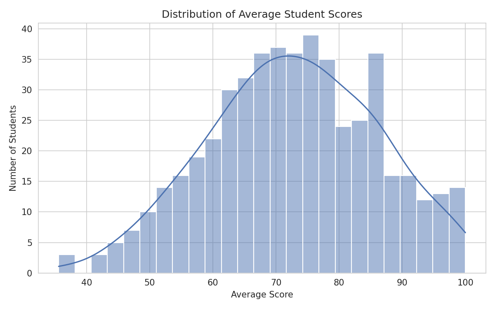
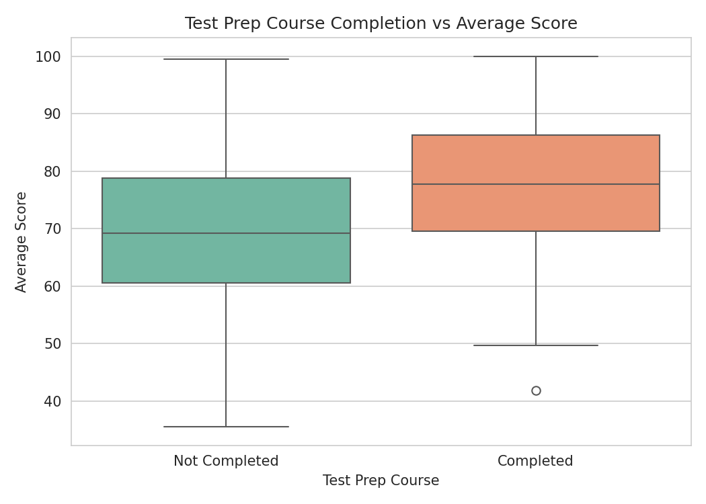
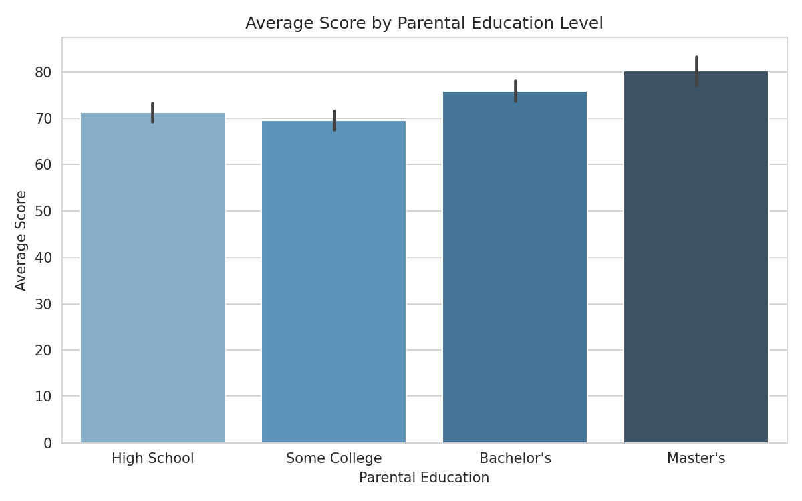
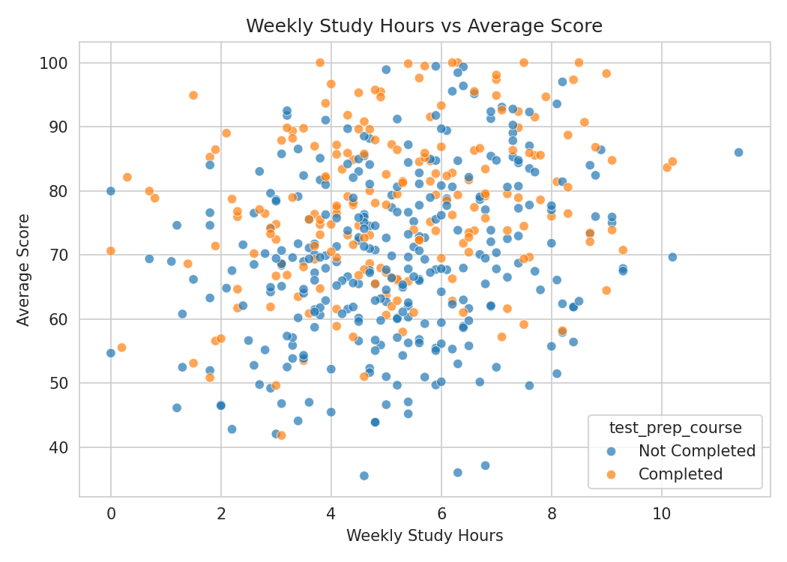
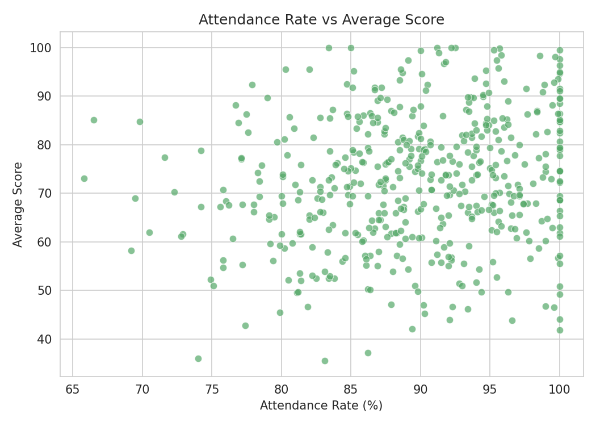

# Do Study Habits Actually Pay Off? A Look at 500 Students

I kept hearing the same advice growing up. Study more, go to class, and take the extra prep course if you can. But I never actually saw anyone check whether that advice holds up with real numbers. So I decided to check it myself.

I took a dataset of 500 students, including their study habits, attendance, family background, and their final scores in math, reading, and writing, and asked three simple questions.

1. Does taking a test prep course actually help?
2. Does a parent's education level make a difference for their kid's grades?
3. Do the obvious habits, like studying more and showing up to class, actually show up in the scores?

## What I found

Test prep courses made a real difference. Students who completed a test prep course scored about 8 points higher on average (77.6 vs. 69.5, out of 100) than students who didn't take one. That's not a small gap. It's roughly the difference between a C+ and a B+.

Parents' education level tracked with student scores too. Students whose parents had a Master's degree averaged around 80 points, while students whose parents' highest level of schooling was High School averaged around 71 points. The pattern wasn't a perfectly straight line for every single group, but the overall trend was clear. More parental education lined up with higher scores.

Study hours and attendance mattered, but less than I expected. Both were linked to better scores. Students who studied more and showed up more often did tend to score higher. But the relationship was mild rather than dramatic. In other words, showing up and studying helps, but it isn't the single biggest lever here. Test prep and family background moved the needle more.

## How I got there

I didn't have access to a real school's private student records, and for good reason, since that kind of data is sensitive and protected. So instead I built a realistic, made up dataset of 500 students that mirrors what a real one would look like. It includes scores, study hours, attendance, parental education, and whether each student completed a test prep course. This let me practice the full analysis process from start to finish without touching anyone's real, private information.

From there, I used Python, which is a common programming language for working with data, to do a few things. I cleaned and organized the data into a table I could actually analyze. I calculated each student's average score across their three subjects. I compared groups against each other, like test prep versus no test prep, and different parent education levels. And I built five charts to make the patterns easy to see at a glance instead of buried in spreadsheet rows.

## The charts, in plain terms

| Chart | What it shows |
|---|---|
| Score distribution | How most students' scores cluster around the middle, with fewer students way at the top or way at the bottom. |
| Test prep impact | A side-by-side comparison of scores with and without the course, so the gap is easy to see visually. |
| Parental education impact | The step up in average scores as parental education increases. |
| Study hours vs. score | The mild upward trend between hours studied and performance. |
| Attendance vs. score | That same kind of trend, but for how often a student actually showed up to class. |











## A peek at the code

Here is the script that did the actual work, in case you want to see how it comes together.


## Why this matters

This project isn't really about these particular 500 students. It's meant to show how I approach a question with data. I start with something people assume is true, go find the numbers, and let the evidence either back it up or complicate it. In this case, the evidence mostly backed up the conventional wisdom, but it also showed that some obvious factors, like just studying more, mattered less than others, like completing a structured prep course. That kind of nuance is easy to miss without actually running the numbers yourself.

## Tools I used

- **Python** — the language everything here is written in
- **pandas** — organizing and summarizing the data
- **matplotlib** and **seaborn** — building the charts

## Want to run it yourself?

```bash
pip install pandas numpy matplotlib seaborn
python generate_data.py
python analysis.py
```

The first command installs everything you need. The second one builds the sample dataset. The third one runs the analysis and saves the charts.

## A note on the data

The dataset is synthetically generated, meaning I built it myself rather than pulling it from a real school. That was a deliberate choice. It means the project is fully shareable and reproducible without any privacy concerns, while still reflecting patterns that feel realistic and believable.
